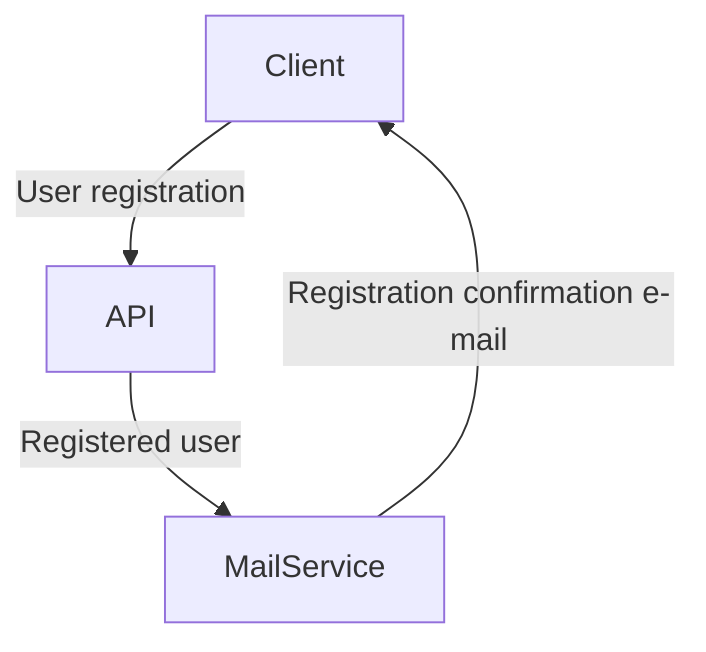

# A very (**very**) simple Webhook implementation in Python

A simple webhook implementation between two different API services

### About the app

This apps simulates a user registration in an application which is split between two services:

- A REST API
- A mailing service

When a user registers, a background task (sending the e-mail) is scheduled to run after the request. The API server sends the request with the user's e-mail to the mailing service which then sends the e-mail to the user.

### Application flow

**Obs:** Flowchart made with Mermaid, to visualize is use a markdown editor such as [StackEdit](https://stackedit.io).



### Installation

Requirements:

- Python
- Node

#### Initialize virtual environment

```
$ python -m venv ./venv
```

#### Install the dependencies

```
$ pip install -r requirements.txt
```

### Scripts

#### REST API

```sh
$ yarn dev:api
```

#### Mailing service

```sh
$ yarn dev:mail
```

#### Testing the integration

```sh
$ yarn send:request
```
